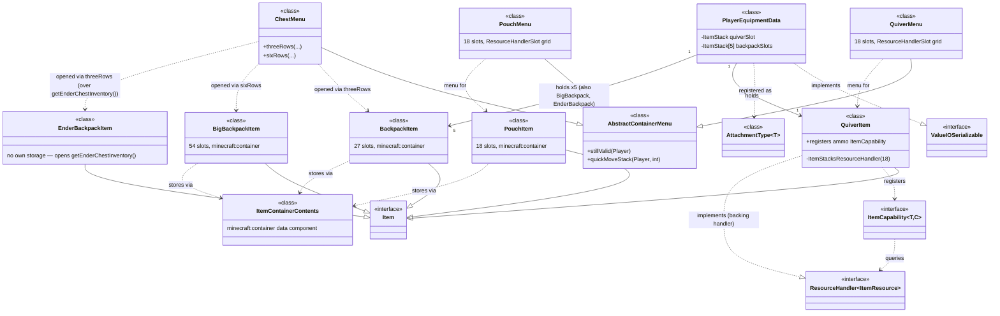
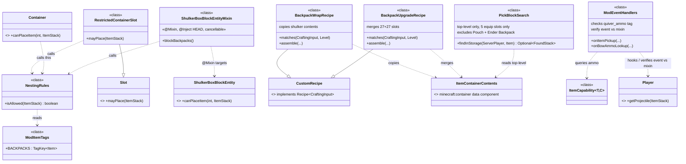

# SimpleBackpack — Developer Documentation

**Target:** NeoForge 26.2.0.x, Minecraft 26.2 ("Chaos Cubed")
**Toolchain:** Java 25 required (26.1+ dropped Java 21). Official setup: [Getting Started with NeoForge](https://docs.neoforged.net/docs/gettingstarted/)
**Scope:** Quiver, Pouch, Backpack (27), Big Backpack (54), Ender Backpack, dedicated player equipment slots, auto-pickup routing, bow/crossbow ammo interception, crafting recipes, anti-nesting rules, middle-click ("pick block") quick search.

> This document is the technical companion to the main [README](README.md). It's aimed at contributors and anyone building or extending the mod — the README stays focused on what the mod does in-game.

---

## 🧑‍💻 Development Setup

This project uses the standard NeoForge MDK setup:

1. Clone the repository.
2. Open it in your IDE of choice (IntelliJ IDEA or Eclipse recommended).
3. If you run into missing libraries or dependency issues, run:
   ```
   gradlew --refresh-dependencies
   ```
   To reset the build environment (your code is unaffected), run:
   ```
   gradlew clean
   ```

### Mapping Names

This project uses the official Mojang mappings for methods and fields in the Minecraft codebase. These names are covered by a specific license — see the [Mojang mapping license](https://github.com/NeoForged/NeoForm/blob/main/Mojang.md) for details.

---

## 🧭 Core Design Decisions

1. **Vanilla-first.** Every sub-inventory screen (Backpack, Big Backpack, Ender Backpack) reuses Mojang's own `ChestMenu`/`GenericContainerScreen` — no custom GUI art or layout code. Only Quiver and Pouch (18 slots, not a multiple vanilla ships a screen for) get a small custom menu.
2. **Capabilities are used sparingly.** Only the Quiver needs a real NeoForge capability, because two other systems (auto-pickup, bow lookup) need to generically "find any ammo container" without knowing its type. Backpack-tier items just use vanilla's own `minecraft:container` item data — the same mechanism shulker boxes already use.
3. **Player equipment slots are a Data Attachment**, not a capability — NeoForge splits "arbitrary persistent data" (Data Attachments) from "queryable behavior" (Capabilities), and equipment slots are data, not behavior.
4. **Nesting is blocked with one tag-driven rule, not a matrix.** Nothing tagged "backpack-tier" can go inside a Backpack, Big Backpack, Pouch, or Shulker Box — mirrors how vanilla itself blocks shulker-in-shulker (via `ItemTags.SHULKER_BOXES`), so the rule is datapack-editable rather than hardcoded, and closes the infinite-storage exploit at both the GUI and automation (hopper) level.
5. **Recipes that need to *look at* or *move* stack contents are custom Java recipes**, not JSON — vanilla's ingredient system can only match item identity, not "is this container empty" or "copy these contents." Everything else (any-color wool/shulker matching) is a plain data-driven tag-based recipe, zero code.
6. **Middle-click "pick block" is deliberately narrow in scope**: only searches the 5 equipped Backpack-tier slots, only one level deep (no opening a Shulker Box found inside a Backpack), and skips Pouch (no dedicated slot exists for it) and Ender Backpack (no own stored data to search). Recursive search cost scales with how much loot a player has, which is backwards, and searching loose inventory items would make the dedicated equip slots pointless.

## 🍳 Crafting Logic

- **Wrapper** (intermediate item): Leather + any-color Wool + Honeycomb + String — plain shapeless recipe.
- **Backpack**: 4× Wrapper + any-color Shulker Box — custom recipe; the shulker's contents are copied straight into the new Backpack (both are 27 slots, so it's lossless).
- **Big Backpack**: 2× Backpack — custom recipe; both backpacks' contents are merged (27+27 = 54, exact fit, nothing lost).

---

## API baseline

Current NeoForge (post the [20.3 Capability rework](https://neoforged.net/news/20.3capability-rework/)) splits storage/behavior into two systems:

| System | Purpose | Docs |
|---|---|---|
| **Data Attachments** | Attach arbitrary persistent/transient *data* to block entities, chunks, entities, item stacks. Used here for player equipment slots. | [Data Attachments](https://docs.neoforged.net/docs/datastorage/attachments/) |
| **Capabilities** | Query *behavior* via `BlockCapability` / `EntityCapability` / `ItemCapability`. Used here only for the Quiver's ammo lookup. | [Capabilities](https://docs.neoforged.net/docs/inventories/capabilities) |

Naming note: `IItemHandler` → `ResourceHandler<ItemResource>`, `ItemStackHandler` → `ItemStacksResourceHandler`, `SlotItemHandler` → `ResourceHandlerSlot`, `ResourceLocation` → `Identifier`.

**Storage decision:** Backpack/Big Backpack/Pouch use vanilla's own `minecraft:container` data component (`ItemContainerContents`) directly — no custom capability, since nothing else needs to generically "discover" a backpack. Only the **Quiver** gets a real `ItemCapability`, because the pickup router and bow lookup both need to find "any ammo-capable container" without knowing its concrete type.

---

## Class Diagram 1 — Items, Menus, Player Equipment



## Class Diagram 2 — Nesting Rules, Crafting, Pickup / Bow / Pick-Block



---

## Interface Contract Table

| Your class | Implements/extends | Required methods |
|---|---|---|
| `QuiverItem`, `PouchItem`, `BackpackItem`, `BigBackpackItem`, `EnderBackpackItem` | `Item` | standard constructor only |
| `QuiverMenu`, `PouchMenu` | `AbstractContainerMenu` | `#stillValid(Player)`, `#quickMoveStack(Player, int)` — see [Menus](https://docs.neoforged.net/docs/inventories/menus) |
| `PlayerEquipmentData` | `ValueIOSerializable` (simplest) or `IAttachmentSerializer<T>` (manual) | read/write for persistence — [Data Attachments](https://docs.neoforged.net/docs/datastorage/attachments/) |
| ammo capability provider lambda | `ItemCapability` provider shape `(stack, itemAccess) -> ResourceHandler<ItemResource>` | registered in `RegisterCapabilitiesEvent#registerItem` |
| `RestrictedContainerSlot` | `Slot` | `#mayPlace(ItemStack)` |
| your `Container` impl (backpack/pouch menus) | `Container` | `#canPlaceItem(int, ItemStack)` (automation-path enforcement) |
| `ShulkerBoxBlockEntityMixin` | Mixin `@Inject` target `ShulkerBoxBlockEntity#canPlaceItem` | cancellable injection, `@At("HEAD")` |
| `BackpackWrapRecipe`, `BackpackUpgradeRecipe` | `CustomRecipe` (→ `Recipe<CraftingInput>`) | `matches(CraftingInput, Level)`, `assemble(CraftingInput, HolderLookup.Provider)`, `getSerializer()`, `getType()` — see [Custom Recipes](https://docs.neoforged.net/docs/resources/server/recipes/custom/) |

---

## Design Principles

1. **Capability type = permission.** An item is ammo-eligible only if it exposes the ammo `ItemCapability`. Quiver only — no `instanceof` checks.
2. **Storage tiers are vanilla-multiples of 9**, riding on stock `ChestMenu`-family menus: Quiver 18, Pouch 18, Backpack 27, Big Backpack 54, Ender Backpack 27 (real ender chest inventory, not owned storage).
3. **Player equipment slots** (Quiver + 5 Backpack-tier slots — no Pouch slot) live in a **Data Attachment** on the player, single source of truth.
4. **Nesting rules are tag-driven**, mirroring vanilla's own shulker-box/bundle restriction pattern, not hardcoded item checks.
5. **Recipes needing to inspect or transfer stack contents are custom `Recipe`/`CustomRecipe` implementations**, not data-driven JSON. Color-matching (any of 16 wool/shulker colors) *is* expressible via vanilla tags and needs no custom code.
6. **Pick-block quick search is top-level-only and dedicated-slot-only** — no recursion into nested containers, no scanning loose backpacks in the main inventory.
7. **Only interject when vanilla finds nothing** — every hook (bow lookup, pickup routing, pick-block) is a fallback, never a replacement.

## A Note on Mixins vs. Access Transformers

NeoForge's own docs list only [Access Transformers](https://docs.neoforged.net/docs/advanced/accesstransformers), [Extensible Enums](https://docs.neoforged.net/docs/advanced/extensibleenums), and [Feature Flags](https://docs.neoforged.net/docs/advanced/featureflags) under Advanced Topics — **Mixins are not part of NeoForge's own sanctioned core docs**, but are widely used via the community Mixin Gradle plugin; check [Toolchain Features → Plugins (ModDevGradle)](https://docs.neoforged.net/toolchain/docs/plugins/mdg/) for current wiring. Prefer Access Transformers for "make an existing method accessible"; reserve Mixins for genuinely injecting new logic into a vanilla method body.

---

## Nesting Rules — Tag-Driven, Mirroring Vanilla

**Rule (finalized): no item tagged "backpack-tier" may go inside Backpack, Big Backpack, Pouch, or Shulker Box.** One rule, applied uniformly, everywhere — no per-container matrix.

This mirrors how vanilla itself blocks shulker boxes from bundles: checked against `ItemTags.SHULKER_BOXES`, a data-driven tag, not a hardcoded class list — so third-party mods (or your own future container tiers) can opt in/out via datapack rather than code.

**1. Define the tag** — `data/yourmodid/tags/item/backpacks.json`:
```json
{ "values": ["yourmodid:backpack", "yourmodid:big_backpack", "yourmodid:ender_backpack"] }
```

**2. `TagKey` constant:**
```java
public final class ModItemTags {
    private ModItemTags() {}
    public static final TagKey<Item> BACKPACKS = TagKey.create(
        Registries.ITEM, Identifier.fromNamespaceAndPath("yourmodid", "backpacks"));
}
```

**3. Single rule check:**
```java
public final class NestingRules {
    private NestingRules() {}
    public static boolean isAllowed(ItemStack stack) {
        return !stack.is(ModItemTags.BACKPACKS);
    }
}
```

**4. Enforce at both layers, everywhere:**
- `Slot#mayPlace` — GUI-level (player placing by hand)
- `Container#canPlaceItem` — automation-level (hoppers/other mods bypass the GUI entirely; **must** be checked here too, or the rule is only cosmetic)

```java
// Backpack/BigBackpack/Pouch menu slot
@Override
public boolean mayPlace(ItemStack stack) { return NestingRules.isAllowed(stack); }

// Your Container implementation backing those items
@Override
public boolean canPlaceItem(int slot, ItemStack stack) { return NestingRules.isAllowed(stack); }
```

**5. Shulker Box (vanilla-owned, needs a Mixin):**
```java
@Mixin(ShulkerBoxBlockEntity.class)
public abstract class ShulkerBoxBlockEntityMixin {
    @Inject(method = "canPlaceItem", at = @At("HEAD"), cancellable = true)
    private void yourmodid$blockBackpacks(int slot, ItemStack stack, CallbackInfoReturnable<Boolean> cir) {
        if (!NestingRules.isAllowed(stack)) cir.setReturnValue(false);
    }
}
```
Layered on top of (not replacing) vanilla's existing shulker-in-shulker rejection — `@At("HEAD")` + cancel-on-failure only, vanilla logic still runs the rest of the time.

Reference: [Containers](https://docs.neoforged.net/docs/inventories/container), [Resources → Tags](https://docs.neoforged.net/docs/resources/server/tags).

---

## Crafting — Implementation Details

### Color flexibility — vanilla tags, zero custom code

`#minecraft:wool` and `#minecraft:shulker_boxes` already cover all 16 colors. Standard shapeless JSON:

```json
{
  "type": "minecraft:crafting_shapeless",
  "ingredients": [
    { "item": "minecraft:leather" },
    { "tag": "minecraft:wool" },
    { "item": "minecraft:honeycomb" },
    { "item": "minecraft:string" }
  ],
  "result": { "id": "yourmodid:wrapper", "count": 1 }
}
```

### Backpack recipe (4× Wrapper + 1× any-color Shulker Box) — needs a custom `Recipe`

Vanilla ingredient matching can't inspect stack *contents*, only item identity — so "transfer the shulker's contents into the new backpack" requires Java. Base class: vanilla's `CustomRecipe` (a `Recipe<CraftingInput>` subtype built for exactly this "no ingredients array, just Java logic" case — see [Custom Recipes](https://docs.neoforged.net/docs/resources/server/recipes/custom/) and the [Recipes overview](https://docs.neoforged.net/docs/resources/server/recipes/)).

**Design decision (recommended): transfer contents, don't reject non-empty shulkers** — better UX, and since both Backpack and Shulker Box are 27 slots, the copy is lossless.

```java
public class BackpackWrapRecipe extends CustomRecipe {
    public BackpackWrapRecipe(CraftingBookCategory category) { super(category); }

    @Override
    public boolean matches(CraftingInput input, Level level) {
        int wrapperCount = 0;
        boolean sawShulker = false;
        for (int i = 0; i < input.size(); i++) {
            ItemStack stack = input.getItem(i);
            if (stack.isEmpty()) continue;
            if (stack.is(ModItems.WRAPPER.get())) wrapperCount++;
            else if (stack.is(ItemTags.SHULKER_BOXES)) {
                if (sawShulker) return false;
                sawShulker = true;
            } else return false;
        }
        return wrapperCount == 4 && sawShulker;
    }

    @Override
    public ItemStack assemble(CraftingInput input, HolderLookup.Provider registries) {
        ItemStack shulker = ItemStack.EMPTY;
        for (int i = 0; i < input.size(); i++) {
            ItemStack s = input.getItem(i);
            if (s.is(ItemTags.SHULKER_BOXES)) { shulker = s; break; }
        }
        ItemStack backpack = new ItemStack(ModItems.BACKPACK.get());
        backpack.set(DataComponents.CONTAINER,
            shulker.getOrDefault(DataComponents.CONTAINER, ItemContainerContents.EMPTY));
        return backpack;
    }

    @Override public RecipeSerializer<?> getSerializer() { return ModRecipeSerializers.BACKPACK_WRAP.get(); }
    @Override public RecipeType<?> getType() { return RecipeType.CRAFTING; }
}
```

### Big Backpack upgrade (2× Backpack → 1× Big Backpack) — merge, don't reject

27 + 27 = 54 exactly — lossless merge, no capacity overflow possible with exactly 2 inputs.

```java
@Override
public boolean matches(CraftingInput input, Level level) {
    int backpackCount = 0;
    for (int i = 0; i < input.size(); i++) {
        ItemStack s = input.getItem(i);
        if (s.isEmpty()) continue;
        if (!s.is(ModItems.BACKPACK.get())) return false;
        backpackCount++;
    }
    return backpackCount == 2;
}

@Override
public ItemStack assemble(CraftingInput input, HolderLookup.Provider registries) {
    List<ItemStack> merged = new ArrayList<>();
    for (int i = 0; i < input.size(); i++) {
        ItemStack s = input.getItem(i);
        if (s.is(ModItems.BACKPACK.get())) {
            merged.addAll(s.getOrDefault(DataComponents.CONTAINER, ItemContainerContents.EMPTY).stream().toList());
        }
    }
    ItemStack big = new ItemStack(ModItems.BIG_BACKPACK.get());
    big.set(DataComponents.CONTAINER, ItemContainerContents.fromItems(merged));
    return big;
}
```

### Registration

`DeferredRegister<RecipeSerializer<?>>` entry per custom recipe (`CustomRecipe.Serializer` if no JSON-configurable fields needed — exact constructor shape in [Custom Recipes](https://docs.neoforged.net/docs/resources/server/recipes/custom/)), plus a sensible `CraftingBookCategory` so these show up correctly in the recipe book.

---

## Pick-Block Quick Search — Top-Level Only, Dedicated-Slots Only

**Finalized rules:** recursive search was rejected outright — a filled Big Backpack (54) containing Shulker Boxes (27 each) containing Pouches (18 each) blows up combinatorially per click, and cost scales *up* with player wealth, which is backwards. Loose backpacks sitting in the main inventory are also excluded — only the dedicated equipment slots are searched, which is what actually makes those slots worth equipping into in the first place, rather than a cosmetic UI nicety.

**Pouch is excluded entirely** — it has no dedicated equipment slot (only Quiver + 5 Backpack-tier slots exist in `PlayerEquipmentData`), so there is nothing top-level for the search to reach.

**Ender Backpack is excluded** — no own `minecraft:container` data to search (it reads the live ender chest instead).

```java
public final class PickBlockSearch {
    private PickBlockSearch() {}

    /** Searches ONLY the 5 equipped backpack-tier slots. Top-level only, no recursion.
     *  Explicitly excludes Pouch (no equip slot exists) and Ender Backpack (no own data). */
    public static Optional<FoundStack> findInStorage(ServerPlayer player, Item target) {
        PlayerEquipmentData equipment = player.getData(ModAttachments.EQUIPMENT.get());
        for (ItemStack equipped : equipment.getBackpackSlots()) { // exactly 5
            Optional<FoundStack> found = searchOne(equipped, target);
            if (found.isPresent()) return found;
        }
        return Optional.empty();
    }

    private static Optional<FoundStack> searchOne(ItemStack containerStack, Item target) {
        if (containerStack.isEmpty()) return Optional.empty();
        // Backpack/BigBackpack only reach here — Ender Backpack has no CONTAINER data component
        List<ItemStack> items = containerStack
            .getOrDefault(DataComponents.CONTAINER, ItemContainerContents.EMPTY)
            .stream().toList();
        for (int i = 0; i < items.size(); i++) {
            ItemStack candidate = items.get(i);
            if (!candidate.isEmpty() && candidate.is(target)) {
                return Optional.of(new FoundStack(containerStack, i));
            }
        }
        return Optional.empty();
    }

    public record FoundStack(ItemStack sourceContainer, int slotIndex) {}
}
```

**Hooking the action:** vanilla's pick-block packet handling has recently split into `ServerboundPickItemFromBlockPacket`/`ServerboundPickItemFromEntityPacket` (**verify current names/handler location** — not confirmed against live 26.x docs at time of writing). **Check [Concepts → Events](https://docs.neoforged.net/docs/concepts/events) for a pick-block event before defaulting to a packet-handler Mixin.**

**Behavior once found:**
- **Survival:** decrement the found slot (rebuild `ItemContainerContents` with that slot shrunk, write back to the source container stack — same copy-and-shrink pattern used for quiver ammo extraction), then insert into the player's hotbar via `Inventory#add` or equivalent.
- **Creative:** vanilla's creative pick-block duplicates rather than consumes — for creative, treat this purely as an existence check and let vanilla's normal give-logic place the item in hand, without touching backpack contents at all.

---

## Auto-Pickup Routing & Bow/Crossbow Ammo Lookup

1. **Pickup:** subscribe to the item-pickup event (**verify exact event name in** [Concepts → Events](https://docs.neoforged.net/docs/concepts/events)), match against `data/yourmodid/tags/item/quiver_ammo.json`, insert via the ammo `ItemCapability`'s `ResourceHandler` (exact insert method name in [Transactions](https://docs.neoforged.net/docs/inventories/transactions)).
2. **Bow lookup:** **verify whether `ArrowNockEvent`/`ArrowLooseEvent` or a successor now supports ammo substitution** before defaulting to a Mixin into `Player#getProjectile(ItemStack)`. Only act when vanilla's own return value is empty.

---

## Build Modules, Roughly In Order

1. Items + Quiver capability
2. Quiver/Pouch menu & screen
3. Backpack / Big Backpack / Ender Backpack (vanilla `ChestMenu` reuse)
4. Nesting rules (tag + Slot + Container + Shulker Box hook)
5. Crafting recipes
6. Auto-pickup routing
7. Bow/crossbow ammo lookup
8. Player equipment Data Attachment + inventory-screen integration
9. Pick-block quick search

## Suggested Build/Test Order

1. **Items + Quiver capability** — debug-command test insert/extract before any UI
2. **Quiver/Pouch menu + screen** — hardcoded `openMenu` call, confirm `ResourceHandlerSlot` behavior
3. **Backpack/Big Backpack/Ender Backpack** — confirm `ChestMenu` reuse and `minecraft:container` data-component storage
4. **Nesting rules** — test Slot + Container rejection, then the Shulker Box Mixin layer, before moving on
5. **Crafting** — wrapper JSON recipe first (trivial), then the two `CustomRecipe` classes; test both the empty-shulker and non-empty-shulker cases explicitly
6. **Pickup routing** — isolated drop-and-pickup test
7. **Bow ammo lookup** — confirm event-vs-Mixin decision, test only fires when vanilla search is empty
8. **Player equipment `AttachmentType`** — persistence (relog test), sync, then screen injection (budget extra time — most likely Mixin-dependent module)
9. **Pick-block quick search** — last, since it depends on the equipment attachment (step 8) being complete; test survival extraction and creative existence-check paths separately

---

## Registration Checklist

- [ ] `DeferredRegister<Item>` — Quiver, Pouch, Backpack, Big Backpack, Ender Backpack, Wrapper
- [ ] `DeferredRegister<MenuType<?>>` — Quiver, Pouch only; rest reuse vanilla `GENERIC_9x3`/`GENERIC_9x6`
- [ ] `RegisterCapabilitiesEvent` — ammo `ItemCapability` on Quiver only
- [ ] `AttachmentType<PlayerEquipmentData>` registration
- [ ] Item tag `data/yourmodid/tags/item/quiver_ammo.json`
- [ ] Item tag `data/yourmodid/tags/item/backpacks.json` (nesting rule)
- [ ] `DeferredRegister<RecipeSerializer<?>>` — `BackpackWrapRecipe`, `BackpackUpgradeRecipe`
- [ ] Wrapper shapeless recipe JSON (data-driven, no code)
- [ ] Mixin config — `ShulkerBoxBlockEntityMixin`, bow ammo lookup (if no event found), pick-block hook (if no event found)
- [ ] Networking — likely covered by `AttachmentType.Builder#sync`; custom packets only if needed

## Known Open Items to Verify Against Live Docs Before Building

- Exact item-pickup event name
- Whether `ArrowNockEvent`/`ArrowLooseEvent` (or a successor) supports ammo substitution, or whether a `Player#getProjectile` hook is still required
- Current pick-block packet/event hook (`ServerboundPickItemFromBlockPacket`/`ServerboundPickItemFromEntityPacket` naming not yet confirmed against live 26.x docs)
- Mixins aren't part of NeoForge's own sanctioned docs (only Access Transformers are) — check the ModDevGradle plugin docs for current Mixin wiring before relying on it

---

## Reference Index

- [Getting Started](https://docs.neoforged.net/docs/gettingstarted/) — workspace setup, Java 25
- [Registries](https://docs.neoforged.net/docs/concepts/registries) — `DeferredRegister`, `RegisterEvent`
- [Events](https://docs.neoforged.net/docs/concepts/events) — confirm pickup, arrow/projectile, and pick-block event names before writing any Mixin
- [Items](https://docs.neoforged.net/docs/items/)
- [Containers](https://docs.neoforged.net/docs/inventories/container) — `Container`, `SimpleContainer`, Container-on-ItemStack pattern
- [Capabilities](https://docs.neoforged.net/docs/inventories/capabilities) — `ItemCapability`, `ResourceHandler<ItemResource>`
- [Menus](https://docs.neoforged.net/docs/inventories/menus) — `AbstractContainerMenu`, `MenuType`, `ResourceHandlerSlot`
- [Transactions](https://docs.neoforged.net/docs/inventories/transactions) — exact `ResourceHandler` insert/extract signatures
- [Data Storage → Data Attachments](https://docs.neoforged.net/docs/datastorage/attachments/) — `AttachmentType`, serialization, sync
- [Resources → Tags](https://docs.neoforged.net/docs/resources/server/tags) — ammo tag, backpacks nesting tag
- [Resources → Recipes overview](https://docs.neoforged.net/docs/resources/server/recipes/) — `Recipe<T>`, `CraftingInput`, `RecipeType`
- [Resources → Custom Recipes](https://docs.neoforged.net/docs/resources/server/recipes/custom/) — `CustomRecipe`, `RecipeSerializer`, `RecipeBuilder`
- [Networking](https://docs.neoforged.net/docs/networking/)
- [Advanced Topics → Access Transformers](https://docs.neoforged.net/docs/advanced/accesstransformers)
- [Toolchain Features → Plugins (ModDevGradle)](https://docs.neoforged.net/toolchain/docs/plugins/mdg/) — Mixin wiring lives here, not core docs

---

## 📚 Resources

- [NeoForged Documentation](https://docs.neoforged.net/)
- [NeoForged Discord](https://discord.neoforged.net/)